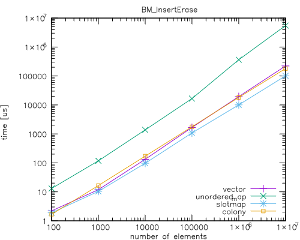

# C++ Slotmap Implementation

This is a C++ slotmap implementation. For a detailed explanation of what a
slotmap is, see:

 * [Allan Deutsch (2017). C++ Now 2017: "The Slot Map Data Structure".](https://youtu.be/SHaAR7XPtNU?si=6clk4jhFL_sk50lY)
 * [Sean Middleditch (2013). Data Structures for Game Developers: The Slot Map.](https://web.archive.org/web/20180121142549/http://seanmiddleditch.com/data-structures-for-game-developers-the-slot-map/)

This implementation is work in progress. Known features missing are:

 * Copy assignment operator.
 * STL-style iterators.
 * Currently using [`std::bitset`](https://en.cppreference.com/w/cpp/utility/bitset) 
   for alive bits, which doesn't support efficient iteration over set bits. Custom 
   implementation which would use 'leading zeros' or 'trailing zeros' instructions is planned.

## Source

The slotmap implementation is in the `slotmap/slotmap.h` and `slotmap/slotmap.inl` files.

## Benchmarks

There is a Google Benchmark based benchmark in the `slotmap-benchmarks` directory.

### BM_Bitset_Iteration

Currently, the slotmap implementation uses a bitset to manage the alive/dead
flags of the individual slots. It is also used as a "boolean skip field" during
iteration over all elements. The implementation supports either `std::bitset` or
a custom implementation of bitset, `slotmap::FixedBitSet`. It is very similar in
principle to `std::bitset`, but supports fast iteration over set bits using
builtin functions (`_BitScanForward` or `__builtin_ctzll`). Paradoxically,
actual implementations of `std::bitset` often have function that do the same
thing, but unfortunately they are not part of the standart interface and so they
cannot be used in portable code. The current plan is to also implement a
skipfield and include it in the comparison as well. 

In each case, the bitset size was 1 000 000 bits. Each bit was set to a random
value with the probabity of 'true' being the desired fill rate (0%, 10%, 20%,
30%, 40%, 50%, 60%, 70%, 80%, 90% and 100%).

The compared methods are:

* `std::bitset` - a for loop over a `std::bitset`, checking each bit at every index.
* `FixedBitSet` - custom implementation of bitset using it's
  `FindNextBitSet(...)` member function.  
* `FixedBitSet / ForEach` - the same custom implementation, but using a
  `ForEach(...)` member function. Simlarly to `std::for_each`, this function
  takes a functor as an argument and calls the functor for each bit set.

#### Results

Perhaps surprisingly, the `std::bitset` has worst performance at around 50% bits
set. My hypothesis for why this is that this is caused by the branch prediction
for the if-statement checking each bit.

Both ways of iteration over set bits of `FixedBitSet` are linear in the
percantage of bits set, suggesting they indeed accelearate skipping over unset
bits. The `FindNextBitSet(...)` function has higher overhead, because it needs
to decode the slotmap for each step of the iteration.

### BM_InsertErase

| Elements |    vector |  unordered\_map |   slotmap |    colony |
| -------: | --------: | --------------: | --------: | --------: |
|      100 |      2313 |           12912 |      3577 |      1793 |
|     1000 |     11883 |          116297 |     13938 |     16482 |
|    10000 |    111106 |         1354761 |    124286 |    167610 |
|   100000 |   1508250 |        16829002 |   1397777 |   1702604 |
|  1000000 |  18741405 |       352602200 |  13472431 |  17606432 |
| 10000000 | 203556933 |      5373849100 | 132865175 | 179067467 |

### BM_Iteration

| % of bits set |  vector |  unordered\_map | slotmap/std::bitset | slotmap | slotmap/foreach |  colony |
| ------------: | ------: | --------------: | ------------------: | ------: | --------------: | ------: |
| 0             |   0.236 |           0.779 |               0.237 |   0.235 |           0.235 |   0.236 |
| 25            | 4301083 |        13949860 |             4386942 | 2838624 |         1819588 | 1371352 |
| 50            | 5299380 |        24772943 |             5483084 | 4181928 |         2637951 | 2328349 |
| 75            | 4367373 |        34134640 |             4925899 | 5232540 |         3044984 | 2742511 |
| 100           | 3178315 |        43031847 |             4207817 | 6577767 |         3156624 | 2915600 |

## Tests

There are Google Test based tests in the `slotmap-tests` directory.
