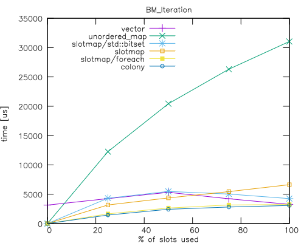

# C++ Slotmap Implementation

This is a C++ slotmap implementation.

 * Associative container. Keys are unsigned integers and are automatically
   assigned to elements on insertion.
 * Insertions and deletions of other elements do not invalidate the keys.
 * Pointers and references to elements are stable. The elements are never moved
   in memory.
 * Random access has *O(1)* time complexity in the worst case.
 * Insertions and deletions have *O(1)* time complexity in the worst case.
 * Fast iteration over valid elements (see benchmarks).
 * Supports both dynamically and statically allocated storage.
 * Supports keys of any unsigned integer type of at least 16 bits.

For more information about slotmap as a concept, see:

 * [Allan Deutsch (2017). C++ Now 2017: "The Slot Map Data Structure".](https://youtu.be/SHaAR7XPtNU?si=6clk4jhFL_sk50lY)
 * [Sean Middleditch (2013). Data Structures for Game Developers: The Slot Map.](https://web.archive.org/web/20180121142549/http://seanmiddleditch.com/data-structures-for-game-developers-the-slot-map/)

This implementation is work in progress. Known features missing are:

 * STL-style iterators.
 * Make the FixedBitSet implementation as close to being a drop-in replacement
   for std::bitset as possible.

## Source

The slotmap implementation is in the `slotmap/slotmap.h` and `slotmap/slotmap.inl` files.

## Benchmarks

There is a Google Benchmark based benchmark in the `slotmap-benchmarks` directory.

Below are the results of selected benchmarks. They were ran on Intel Core
i9-10850K 3.60GHz CPU with 32GB RAM. The benchamrk suite was compiled with
Clang.

### BM_Bitset_Iteration

Currently, the slotmap implementation uses a bitset to manage the alive/dead
flags of the individual slots. It is also used as a "boolean skip field" during
iteration over all elements. The implementation supports either `std::bitset` or
a custom implementation of bitset, `slotmap::FixedBitSet`. It is very similar in
principle to `std::bitset`, but supports fast iteration over set bits using
builtin functions (`_BitScanForward` or `__builtin_ctzll`). Paradoxically,
actual implementations of `std::bitset` often have function that do the same
thing, but unfortunately they are not part of the standart interface and so they
cannot be used in portable code. The current plan is to also implement a
skipfield and include it in the comparison as well. 

In each case, the bitset size was 1 000 000 bits. Each bit was set to a random
value with the probabity of 'true' being the desired fill rate (0%, 10%, 20%,
30%, 40%, 50%, 60%, 70%, 80%, 90% and 100%).

The compared methods are:

* `std::bitset` - a for loop over a `std::bitset`, checking each bit at every index.
* `FixedBitSet` - custom implementation of bitset using it's
  `FindNextBitSet(...)` member function.  
* `FixedBitSet / ForEach` - the same custom implementation, but using a
  `ForEach(...)` member function. Simlarly to `std::for_each`, this function
  takes a functor as an argument and calls the functor for each bit set.

#### Results

Perhaps surprisingly, the `std::bitset` has worst performance at around 50% bits
set. My hypothesis for why this is that this is caused by the branch prediction
for the if-statement checking each bit.

Both ways of iteration over set bits of `FixedBitSet` are linear in the
percantage of bits set, suggesting they indeed accelearate skipping over unset
bits. The `FindNextBitSet(...)` function has higher overhead, because it needs
to decode the slotmap for each step of the iteration.

### BM_InsertErase

#### Pseudocode

    Insert N elements into the container
    Clear the container
    Insert N elements into the container
    For each inserted key:
       Erase the key from the slotmap

#### Results

The times are in nanoseconds.

| Elements |    vector | unordered\_map |   slotmap |    colony |
| -------: | --------: | -------------: | --------: | --------: |
|      100 |      2202 |          13075 |      1886 |      1678 |
|     1000 |     11898 |         117732 |     10422 |     16504 |
|    10000 |    132910 |        1378636 |     96990 |    171081 |
|   100000 |   1663162 |       16605540 |   1077619 |   1762114 |
|  1000000 |  19428353 |      363784350 |  10058595 |  18165161 |
| 10000000 | 222740967 |     5514846000 | 101167150 | 180534925 |

Note the graph below uses logarithmic scale for both x and y axis. In this case
that means that `unordered_map` is around an order of magniture worse than
everything else.

### BM_Iteration

To prepare the test data, this benchmark fills a container with 1000000 elements
and then randomly selects a set percentage of them and removes them. The intent
is to create "holes" in what is essentially a sparse array.

The measured part of the benchmark then simply iterates over all elements in the
slotmap and adds them up using a checksum variable.

The compared collections are:

* `vector` - a simple `std::vector` with boolean alive flags and a free list
* `unordered_map` - `std::unordered_map` with a counter to automatically assign IDs
* `slotmap/std::bitset` - `SlotMap`, but using `std::bitset` instead of the default `FixedBitSet`
* `slotmap` - default `SlotMap` using dynamically allocated chunked storage
* `slotmap/foreach` - same as `slotmap`, but using the `ForEach()` function
* `colony` - `plf::colony` (https://github.com/mattreecebentley/plf_colony)

#### Results

The times are in microseconds.

| % of slots used |  vector |  unordered\_map | slotmap/std::bitset | slotmap | slotmap/foreach |  colony |
| --------------: | ------: | --------------: | ------------------: | ------: | --------------: | ------: |
| 0               |    3147 |           0.000 |               0.000 |   0.000 |           0.000 |  0.000  |
| 25              |    4256 |           12266 |                4324 |    3170 |            1661 |   1455  |
| 50              |    5328 |           20436 |                5480 |    4367 |            2654 |   2429  |
| 75              |    4231 |           26320 |                5035 |    5453 |            3167 |   2818  |
| 100             |    3271 |           31041 |                4256 |    6630 |            3249 |   3090  |

### BM_Clear

The times are in microseconds.

| % of slots used |  vector |  unordered\_map | slotmap |   fixed_slotmap |  colony |
| --------------: | ------: | --------------: | ------: | --------------: | ------: |
| 0               |    1.12 |           0.170 |   0.180 |            5.08 |   0.240 |
| 25              |    1.06 |            9048 |   0.430 |            5.12 |   0.500 |
| 50              |    1.37 |           19369 |   0.560 |            4.11 |   0.660 |
| 75              |    1.22 |           32524 |   0.530 |            3.54 |   0.830 |
| 100             |    1.48 |           49599 |   0.670 |            3.07 |   0.910 |

## Tests

There are Google Test based tests in the `slotmap-tests` directory.
